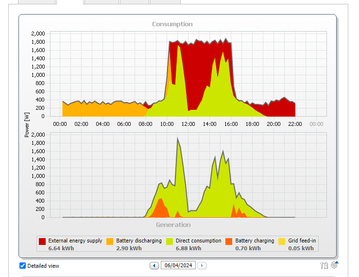
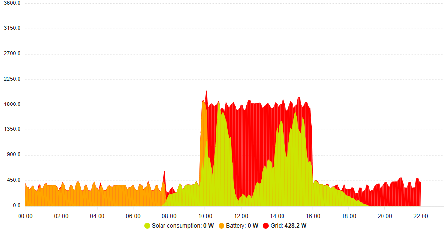
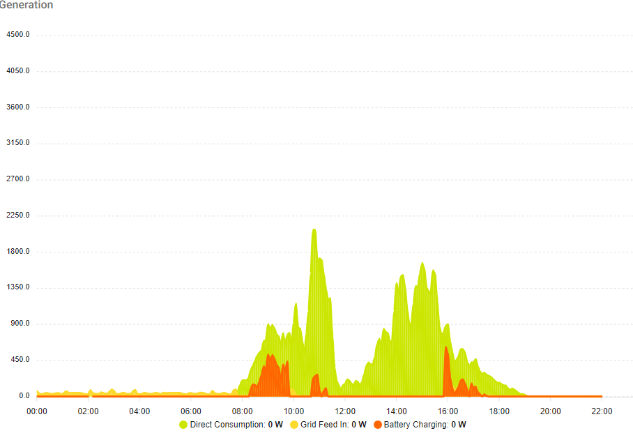

<h1>Home Assistant SMA Energy Graphs Replication</h1>

This project aims to enhance the monitoring and visualisation of energy data within Home Assistant by replicating the energy graphs from the SMA Sunny Portal. The motivation behind this endeavour stems from the limitations and inconsistencies observed in the original SMA graphs, which often fail to update promptly and lack certain desirable features.

To utilise this project, users will need to install the Home Assistant SMA integration. Additionally, for a more personalised experience, users may want to consider renaming the sensors in the sensors.yaml file to better reflect their own system.

Utilising the flexibility and power of Home Assistant, coupled with the Apex Charts integration via the HACS addon, we have successfully recreated the energy graphs with remarkable fidelity. These replicated graphs closely resemble their SMA counterparts while leveraging the extensive customisation options and dynamic capabilities offered by Apex Charts.

By adopting this solution, users can enjoy more reliable and visually appealing energy monitoring within their Home Assistant environment. Whether tracking solar energy production, consumption patterns, or overall energy efficiency, these graphs provide invaluable insights with enhanced functionality.

Through this project, we aim to empower Home Assistant users with comprehensive energy visualisation tools, bridging the gap between the functionality of SMA Sunny Portal graphs and the flexibility of Home Assistant's ecosystem. Welcome to an enhanced energy monitoring experience tailored for your smart home needs.

SMA version

Home Assistant equivalent

